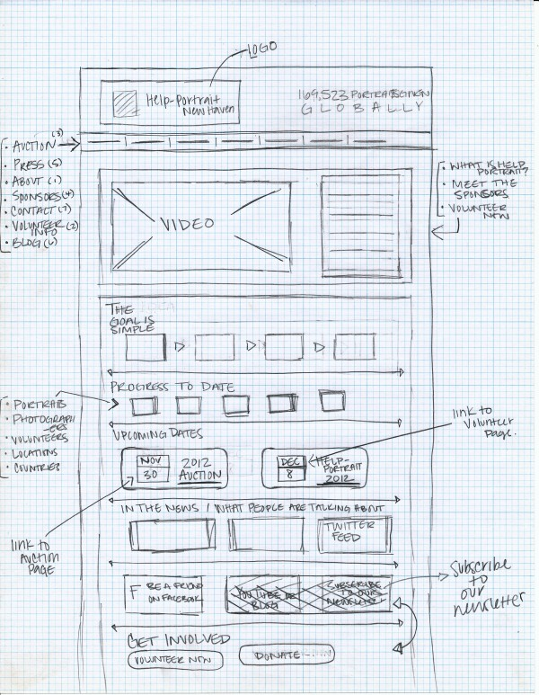

__Lectura:__ Webdesdecero (2015), Wireframes: qué son y cómo crearlos

__*Wireframes*__

Un *wireframe* es un boceto donde se representa visualmente, de una forma __sencilla y esquemática__ la estructura de la página web. 
Lo importante es centrarse en __la funcionalidad del sitio y la experiencia del usuario__.
No hay que meter __ni colores ni tipografías__ ni cualquier elemento gráfico.
¿Para qué sirve?
* Detectar posibles problemas y evitar trabajos innecesarios

__Ventajas__

* Son rápidos y baratos de crear
* Sirve para detectar los problemas antes
* Permite hacer mejoras sencillas
* Mejora la usabilidad de la página web

__Tipos de *wireframes*__

Existen varios tipos de herramientas para crear *wireframes*:
* Creadas a mano: Es la más sencilla y económica y el material necesario es un papel y un bolígrafo.

* Utilizar plantillas imprimibles para wireframes
    * Web sketching template: Creado para imprimir en A4 y con resolución 1024x758
    * Paper Browser: Resolución 1024x780 y con guías para diseños de 960 o 800 píxels.
    * Zurb Responsive Scketches: Web responsive. Se adecua a la herramienta que utilizas: móvil, tablet, ordenador...
    * Sticky Jots
* Utilizar un programa o aplicación
    * Mockflow: Para crear wireframes en la nube
    * Balsamiq Mockups: la aplicación más usada

